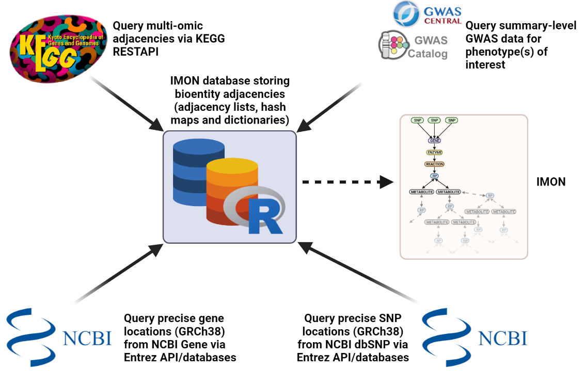

```{r init, results='hide', echo=FALSE, warning=FALSE, message=FALSE}
library(knitr)
opts_chunk$set(warning=FALSE, message=FALSE)
BiocStyle::markdown()
```


# Introduction
  The purpose of the PanViz package is to provide researchers with a novel method for analysing summary-level Genome-Wide Association Study (GWAS) data, such as that provided by the GWAS Catalog [@Buniello2019], or GWAS Central [@Beck2014] databases, or their own study data, within the context of the genome and metabolome via integration with biochemical networks queried from the Kyoto Encyclopaedia of Genes and Genomes (KEGG) [@Kanehisa2000]. See Figure 1 below for an overview of the methodology used by PanViz.

```{r,echo=FALSE, fig.cap="\\label{fig:figs}PanViz methodology. 1) Biochemical reaction network data (capturing multi-omic adjacencies) was queried from the Kyoto Encyclopaedia of Genes and Genomes (KEGG) database. A capture of this data (captured in August 2021) is stored locally in compressed adjacency lists so that no KEGG queries have to be made whilst using the package, in order to improve computation speeds. However, users can choose to update the local database at any point in order to use the most up-to-date KEGG database using the get_kegg_data() function - see Section X. 2) Precise genomic locations for the genes present within the KEGG biochemical reaction networks were queried via the NCBI Gene databse. Similarly, a capture of this data is stored locally, however, this can also be updated along with the KEGG database using the get_kegg_data() function. 3) Genome-wide Association study (GWAS) summary-level data (such as that provided by the GWAS Catalog or GWAS Central databases) is inputted by the user. 4) The precise chromosome locations for the single nucleotide polymorphisms (SNPs) present within the inputted summary-level GWAS data are queried via the NCBI dbSNP databse. 5) Once SNP locations are queried, SNPs can be mapped onto KEGG genes if they fall within a 1Mb range upstream or downstream of a gene location, and thus the SNPs can be integrated into the KEGG biochemical reaction networks, producing an 'integrated multi-omic network' or IMON."}
# Small fig.width

```


  PanViz aims to overcome some prevalent issues found within the area of translating GWAS summary-level data into biological mechanistic insights, such as the 'missing heritability' problem, where few associated SNPs are seemingly related to the phenotype in question due to low effect sizes [@Manolio2009]. Thus, unlike more traditional analyses, and following the meta-analysis paradigm, PanViz allows users to assess the cumulative effects of all the associated SNPs, from as many studies as chosen, for a given phenotype within the context of biochemical reaction networks. See Figure 2 below for an example mock-up schema demonstrating the overall structure of the resulting networks, termed "integrated multi-omic networks" or IMONs. The analysis of the resulting IMONs is ultimately open-ended. For instance, one can choose to analyse the various vertex (bio-entity) types present within the IMON, such as metabolic pathway enrichment analysis, or employ spectral techniques to compare different IMONs representing various phenotypes of interest in order to compare trait similarities and dissimilarities.


```{r,  echo=FALSE, fig.cap="\\label{fig:figs}Mock-up integrated multi-omic network (IMON) schema. Single nucleotide polymorphisms (SNPs) associated with a target phenotype (present within summary-level genome-wide association study data) are mapped to genes if they fall within a 1Mb range upstream or downstream of a gene location. Once SNPs are mapped to genes, they are integrated into the biochemical reaction networks queried from the Kyoto Encyclopaedia of Genes and Genomes (KEGG) database - see figure.1. Here, genes are adjacent to enzymes, which themselves catalyse biochemical reactions. KEGG reactions are further classified by RClass, here denoted as RP or 'reaction pairs', where each RP (and thus reaction) are associated with metabolite substrates and products. Thus, by choosing to construct ego-centred networks (centred around the SNPs present within the IMON) with specified orders greater than or equal to 5, one can adjust the amount of the metabolome represented within the whole IMON. An ego-centred order of 5 here would thus represent the first layer of the metabolome."}
# Small fig.width

```

# Installation
Ensure the PanViz package is correctly installed

```{r install, eval = FALSE}
## install from Bioconductor BiocManager
pkgs <- c("PanViz")
pkgs_required <- pkgs[!pkgs %in% rownames(installed.packages())]
BiocManager::install(pkgs_required)
```

Load the PanViz and other libraries into the _R_ session

```{r setup, message = FALSE}
library(PanViz)
library(igraph)
library(networkD3)
```


# Constructing an IMON
There are two main functions disposable to a user in order to create an IMON from summary-level GWAS data: get_IMON() and get_grouped_IMON().

## Handling a single vector of summary-level data: get_IMON()
In the case where only a single vector of summary-level GWAS data is available for a given phenotype, e.g. the user has ran their own GWAS, users can use the get_IMON() function. For example, using summary-level data for estrogen receptor-positive breast cancer (EFO_1000649) sourced from the GWAS Catalog (downloaded August 2021) as a mock-up example of a single vector of associated SNPs. Note, that the resulting IMON object is actually an igraph object that can be further manipulated and visualised as any other igraph object. Note, that the ego argument here dictates the order of the ego-centred network constructed (centred around the inputted SNPs in the network) from the total reaction/metabolic network. In other words, ego represents the path-length of the network from the SNP level down into the metabolome, where an ego of 5 represents one single layer of the metabolome (SNP -> gene -> enzyme -> reaction -> RP (level 1) -> Metabolite (level 1)). Therefore, extending the ego beyond 5 will simply add another RP or metabolite layer and will reflect a further level into the metabolome.

```{r}
##importing the estrogen receptor positive breast cancer example SNP vector
data(er_snp_vector)
snps <- er_snp_vector
##creating an IMON using this summary-level GWAS data
IMON <- PanViz::get_IMON(snp_list = snps, ego = 5, save_file = FALSE, progress_bar = FALSE)
```


```{r}
##inspecting IMON:
print(IMON)
```


The constructed IMON is returned as an igraph object that can be further manipulated or visualised within _R_ using the igraph library. Alternatively, the IMON can be saved and exported from _R_ by setting the argument save_file = TRUE and setting additional optional arguments export_type = c("igraph", "edge_list", "graphml", "gml") and directory = c("wd", "choose").

```{r, eval = FALSE}
##creating an IMON and exporting as an graphml file within an user chosen directory
IMON <- PanViz::get_IMON(snp_list = snps, ego = 5, save_file = TRUE, export_type = "graphml", directory = "choose")
```

Note that when the argument directory = "wd" (default), the exported file is saved within the user's current working directory, whereas setting directory = "choose" enables a user to select a directory in which to save the graph file via an interactive interface.

## Handling summary-level GWAS .tsv files sourced from GWAS Catalog: get_grouped_IMON()
In the case that a summary-level associations tsv file was downloaded from the GWAS Catalog, users can use the GWAS_data_reader() function to parse the raw tsv file into an _R_ dataframe object. In this example, a tsv file containing the summary-level associations data for estrogen receptor-positive breast cancer (EFO_1000649) is used.

```{r}
##getting tsv file directory path from package data directory - this will be replaced with the users own tsv file path
path <- system.file("extdata", "gwas-association-downloaded_2021-09-13-EFO_1000649.tsv", package="PanViz")
##parsing tsv file into dataframe object
snp_df <- PanViz::GWAS_data_reader(file = path, snp_col = "SNPS", study_col = "STUDY", trait_col = "DISEASE/TRAIT")
head(snp_df)
```

Once the tsv file has been parsed to a dataframe object, the summary-level data can be used to construct an IMON. Furthermore, users have the option to group the data, and colour the network based on the chosen grouping variable, either by study or by reported trait (as defined within the GWAS Catalog association file). Note, there is a limit of 50 total grouping variables.

```{r}
##creating IMON using the first 5 studies reported and creating a grouping variable based on studies
snp_df <- dplyr::filter(snp_df, studies %in% unique(snp_df$studies)[1:5])
IMON <- PanViz::get_grouped_IMON(dataframe = snp_df, groupby = "studies", ego = 5, save_file = FALSE, progress_bar = FALSE)
```

## Handling summary-level GWAS .tsv files sourced from GWAS Central
As above, in the case that summary-level GWAS data was downloaded from GWAS Central, users can use the GWAS_data_reader() function to parse the raw tsv file into an _R_ dataframe object. In this example, a tsv file containing the summary-level associations data for estrogen receptor-positive breast cancer (MeSH term: D001943) is used. Note, that here we change the column identifiers within the function to those used by the respective database (these can always be checked by opening the relevant data files in R or Microsoft Excel). To this end, a user could actually use the GWAS_data_reader() function for any data file, not necessarily one sourced from either GWAS Catalog or GWAS Central, that contains SNP, study and phenotype/trait information.

```{r, eval = FALSE}
##getting tsv file directory path from package data directory - this will be replaced with the users own tsv file path
path <- system.file("extdata", "GWASCentralMart_ERplusBC.tsv", package="PanViz")
##parsing tsv file into dataframe object
snp_df <- PanViz::GWAS_data_reader(file = path, snp_col = "Source Marker Accession", study_col = "Study Name", trait_col = "Annotation Name")
```


# Analysing an IMON:
The get_IMON() and get_grouped_IMON() functions return igraph objects that can be further manipulated and visualised. The get_grouped_IMON() further has an argument colour_groups which when set TRUE will colour the network by the respectively chosen grouping categorical variable (either studies or traits) for pretty visualisations of the respective IMON groups. We can demonstrate this by plotting a graph using a custom Reingold Tilford tree algorithm, where we can see how the selected studies intersect and relate to one another.


```{r, fig.width=20, fig.height=25}
##creating an IMON again using the first 5 studies reported within the downloaded tsv file, grouping by studies and colouring the nodes/edges of the graph based on these groups:
IMON <- PanViz::get_grouped_IMON(dataframe = snp_df, groupby = "studies", ego = 5, save_file = FALSE, colour_groups = TRUE, progress_bar = FALSE)
##creating custom igraph tree layout plotting from SNP downards to metabolite:
myformat <- function(IMON) {
  layout.reingold.tilford(IMON, root = V(IMON)[grepl("SNP", V(IMON)$type)], flip.y = TRUE, circular = FALSE)
}
##setting format for igraph object:
format <- myformat(IMON)
##plotting the IMON using the custom tree algorithm:
plot(IMON,
     vertex.label = V(IMON)$ID,
     vertex.shape = "square",
     vertex.label.color = "black",
     vertex.label.cex = 1.5,
     vertex.size = 5,
     edge.arrow.size=.5,
     vertex.color= adjustcolor(V(IMON)$color, alpha = 0.5),
     edge.color = adjustcolor(E(IMON)$color, alpha = 0.5),
     edge.width = 2,
     layout = format,
     vertex.frame.width = 0.001,
     #asp = 0.35,
     margin = -0.1
)
##getting the unique group names and their respective colours from the IMON (and using them to create a legend)
unique_group_names <- unique(V(IMON)$group)[!is.na(unique(V(IMON)$group))]
unique_group_cols <- unique(V(IMON)[which(V(IMON)$group %in% unique_group_names)]$color)
groupings <- factor(unique_group_names)
legdata <- legend("topleft", "legend", trace=TRUE,plot=FALSE)
legend(bty = "n", x=legdata$rect$left,y=legdata$rect$top,
       legend=levels(groupings),
       fill=unique_group_cols, border=NA, cex = 1.8)
```


This plot can be further edited using the various plot options and arguments offered by igraph, which can be seen [here](https://www.rdocumentation.org/packages/igraph/versions/0.2.1/topics/plot.igraph). Furthermore, various standard and commonly used graph layouts are available from igraph, which can be viewed [here](https://igraph.org/r/doc/layout_.html).

The igraph object of course can also be manipulated and visualised within other R graph libraries, such as networkD3 that uses the JavaScript library D3 for interactive visualisations.
```{r}
library(networkD3)
##convert the igraph object to a networkd3 object and group by the vertex colours:
IMON_D3 <- networkD3::igraph_to_networkD3(IMON, group =  V(IMON)$color)

# Create force directed network plot
networkD3::forceNetwork(Links = IMON_D3$links, Nodes = IMON_D3$nodes,
             Source = 'source', Target = 'target',
             NodeID = 'name', Group = 'group', zoom = TRUE,
             bounded = TRUE, opacity = 1, opacityNoHover = 1)
```

Additionally, both the get_IMON() and get_grouped_IMON() functions offer various options for users to export their IMON to various typical graph formats either within their current working environment or directory of choice. For instance, a user can save their IMON to an Rda file containing the the igraph object, or alternatively edge list, graphml or gml files. These files can then be used in various other analyses outside of R, for instance graphml files can be used for visualisations and analyses in [Gephi](https://gephi.org/) or imported into Python using [NetworkX](https://networkx.org/).

```{r, eval=FALSE}
##saving IMON in grapml format to a selected directory
PanViz::get_IMON(snp_list = snps, ego = 5, save_file = TRUE, export_type = "graphml", directory = "choose")
```

# Session info
```{r}
utils::sessionInfo()
```

# References
